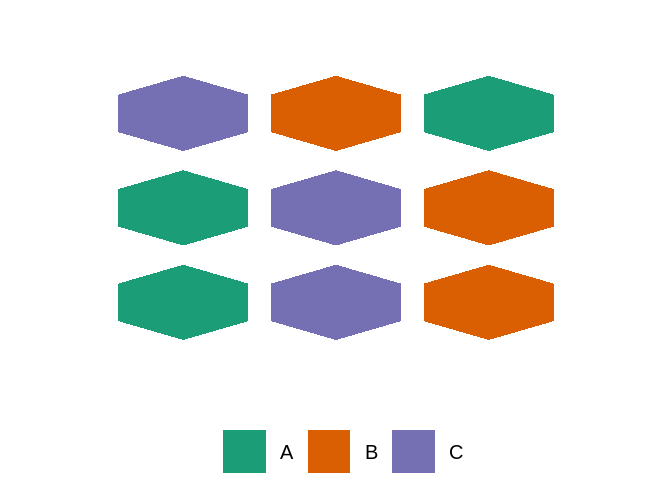
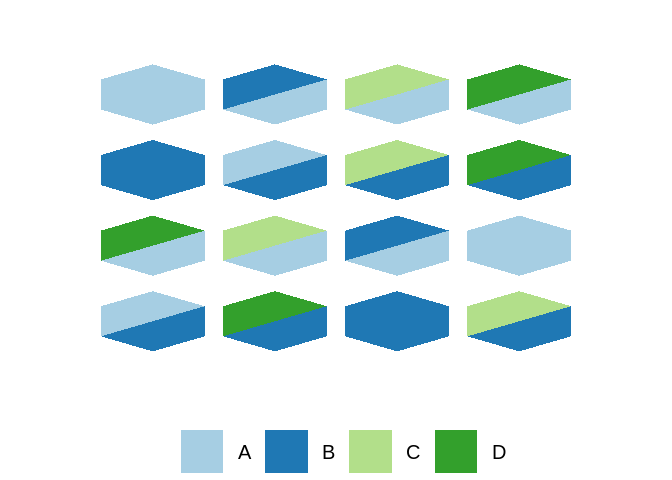

## Overview

The package creates a new `Geom`, `geom_design`, which can be used
alongside `ggplot2` to depict experimental designs. Note that all the
usual `ggplot` machinery can be used.

### Installation

    devtools::install_github("cmjt/ggdesign")

## Using `geom_design()`

Below are some options showing how you might plot some well known
designs. The `R` package `agricolae` is used to simulate the different
designs.

    library(ggplot2)
    library(ggdesign)
    library(agricolae)

### Completely Randomised Design (CRD)

    set.seed(1642)
    trt <- c("A", "B", "C")
    crd <- agricolae::design.crd(trt = trt, r = 2)$book
    crd

    ##   plots r trt
    ## 1   101 1   C
    ## 2   102 1   A
    ## 3   103 2   A
    ## 4   104 2   C
    ## 5   105 1   B
    ## 6   106 2   B

    ggplot(crd, aes(plots = plots, fill = trt)) +
        geom_design()

#### We can change those default colours

    ggplot(crd, aes(plots = plots, fill = trt)) +
        geom_design() + scale_fill_brewer(palette = "Dark2")

#### We can change the type of unit

    ggplot(crd, aes(plots = plots, fill = trt)) +
        geom_design(type = "hex") + scale_fill_brewer(palette = "Dark2")

### Randomised Complete Block Design (RCBD)

    set.seed(1647)
    trt <- c("A", "B", "C")
    rcbd <- agricolae::design.rcbd(trt = trt, r = 3)$book
    rcbd

    ##   plots block trt
    ## 1   101     1   C
    ## 2   102     1   B
    ## 3   103     1   A
    ## 4   201     2   A
    ## 5   202     2   C
    ## 6   203     2   B
    ## 7   301     3   A
    ## 8   302     3   C
    ## 9   303     3   B

    ggplot(rcbd, aes(plots = plots, fill = trt, block = block)) +
        geom_design() + scale_fill_brewer(palette = "Dark2")

### Factorial Design

    set.seed(7861)
    fact <- agricolae::design.ab(trt = c(3, 2), r = 2, design = "crd")$book
    fact

    ##    plots r A B
    ## 1    101 1 1 1
    ## 2    102 1 2 1
    ## 3    103 1 2 2
    ## 4    104 1 3 2
    ## 5    105 2 2 2
    ## 6    106 1 1 2
    ## 7    107 2 3 2
    ## 8    108 2 1 2
    ## 9    109 1 3 1
    ## 10   110 2 2 1
    ## 11   111 2 1 1
    ## 12   112 2 3 1

    ggplot(fact, aes(plots = plots, fill = A, col = B, block = r)) +
        geom_design(type = "hex") + scale_fill_brewer(palette = "Dark2")

### Split-plot Design

    set.seed(8881)
    ## split plot
    trt1 <- c("A", "B"); trt2 <- LETTERS[1:4]
    sp <- agricolae::design.split(trt1 = trt1, trt2 = trt2, r = 2, design = "crd")$book

#### Using colour for the second treatment

    ggplot(sp, aes(plots = plots, fill = trt1, block = splots, col = trt2)) +
        geom_design()

#### Or a different unit shape…

    ggplot(sp, aes(plots = plots, fill = trt1, block = splots)) +
        geom_design(type = "hex_tri") +
        geom_design(aes(fill = trt2), type = "hex_tri", seg = 2) +
        scale_fill_brewer(palette = "Paired")

## Working on ANOVA tables…
